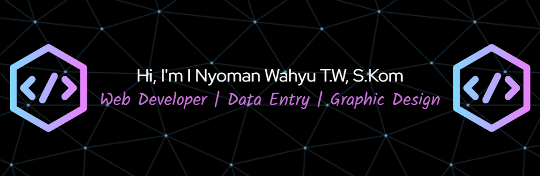

<!-- Background Benner -->



### 👋 Halo semuanya! Saya I Nyoman Wahyu Trisna Winda S.Kom 😁

;Salam Titik Koma🙌

- 🌱 Sekarang lagi asik belajar PHP, ngoprek REST API, sama ngedalami JavaScript biar makin jago.
- 🔭 Lagi sibuk ngulik dan ngerjain berbagai aplikasi web, kadang juga nyemplung ke project full-stack.
- 🤔 Lagi pengen banget dapet insight soal optimasi performa dan gimana bikin arsitektur aplikasi yang rapi dan enak di-maintain📊
- 💬 Ngobrol aja kalau mau tanya-tanya soal HTML, CSS, JavaScript, PHP, MySQL, atau desain UI/UX web. Siapa tau bisa saling sharing dan kerja sama bareng untuk buat Project 🙏
- 👯 Kalau ada yang mau kolaborasi di project open source, frontend atau backend, ayo banget😊
- 📫 Kalau mau ngobrol atau kerja bareng, silakan klik **[📱 Contact](#contact)** yah Guys 😁
- ⚡ Fun fact: Aku selalu semangat ngoding, apalagi kalau ditemani secangkir kopi dan playlist lagu favorit di Spotify dan YouTube. Oh ya, Olahraga Bulu Tangkis dan Lari juga jadi pelarian paling asik kalau lagi penat sama Coding 😂! 🏸

---

### 🛠️ Tech Stack

<!-- [](https://skillicons.dev) -->


---

### 🤖 Artificial Intelligence


---

### 🌠 Graphic Design


---

### 📊 GitHub Stats


---

### 🏆 GitHub Trophy

[](https://github.com/ryo-ma/github-profile-trophy)

---

### 🎉 Fun Time


> _"Code like a champion. Smash like a pro."_ – Me 😄

---

### 🏅 Sertifikat & Penghargaan

- 🐍 [**Sertifikat Pemrograman Python - Special Skill**](https://drive.google.com/file/d/15JUzAltgReKbkBj3z64BIffQWWOxgdyz/view?usp=sharing)
- 🤖 [**Sertifikat Seminar Coding Dengan ChatGPT - Qwords**](https://drive.google.com/file/d/1iovaa-oRwMReVXAa_B-32kH7VQMmZcSi/view?usp=sharing)
- 🚀 [**Sertifikat Brand Identity Design - MySkill Short Class**](https://drive.google.com/file/d/18akCujATqU-LsqgWph5kZi3KwvgC7lrG/view?usp=sharing)
- 🏢 [**Sertifikat KKN Operator OSS-RBA - Mal Pelayanan Publik Pangkep**](https://drive.google.com/file/d/1owl-cxYGbX6rcWhHfJCmIJFJaxWiz0Ra/view?usp=sharing)
- 🏭 [**Sertifikat Magang Industri - MBKM PTSP Pangkep**](https://drive.google.com/file/d/1restqDeQb5V4mZS-Svc-xxSSUAqajZGb/view?usp=sharing)
- 🏅 [**Sertifikat Operator Komputer Madya - VSGA**](https://drive.google.com/file/d/1jbZSGg4zBg2iKOthR71rGHJ06m0vUIzI/view?usp=sharing)


---

### 🚀 Featured Projects

<table>
  <tr>
    <td>
      <h4>🛒 Toko Orange </h4>
      <p><strong>Deskripsi:</strong> Website toko sepatu berbasis web yang menyediakan fitur katalog produk, keranjang belanja, checkout, dan manajemen pesanan. Dibangun menggunakan PHP, CSS, HTML, JavaScript, MySQL, dan Bootstrap.</p>
      <p>
        
        
        
        
        
        
      </p>
      <a href="https://namadomain.com/tokoorange-demo" target="_blank"></a>
      <a href="https://github.com/NyomanWahyu01/Online-Shop" target="_blank"></a>
    </td>
  </tr>
  <tr>
    <td>
      <h4>📝 Survai Kepuasan Masyarakat di Mal Pelayanan Publik</h4>
      <p><strong>Deskripsi:</strong> Aplikasi survei kepuasan masyarakat untuk Mal Pelayanan Publik Pangkep. Pengguna dapat mengisi survei online, admin dapat mengelola dan menganalisis hasil survei. Dibangun dengan JavaScript, CSS, PHP, Tailwind CSS, Bootstrap, MySQL, dan HTML5.</p>
      <p>
        
        
        
        
        
        
        
      </p>
      <a href="https://namadomain.com/survai-mpp-demo" target="_blank"></a>
      <a href="https://github.com/NyomanWahyu01/Survai-MPP" target="_blank"></a>
    </td>
  </tr>
  <tr>
    <td>
      <h4>🏸 Pendaftaran Anggota Baru Badminton Smapul Club Berbasis Web</h4>
      <p><strong>Deskripsi:</strong> Aplikasi pendaftaran anggota baru untuk klub badminton, mendukung fitur CRUD data anggota, validasi, dan export data. Dibangun dengan PHP, MySQL, Bootstrap, Tailwind CSS, HTML5, CSS, dan JavaScript.</p>
      <p>
        
        
        
        
        
        
        
      </p>
      <a href="https://namadomain.com/project-bsc-demo" target="_blank"></a>
      <a href="https://github.com/NyomanWahyu01/Project-Bsc" target="_blank"></a>
    </td>
  </tr>
</table>

---

### 📄 Download CV

[](https://drive.google.com/file/d/1dtsnEkmGVh8uDE_XmcCOMxtkBqEiT_t4/view?usp=sharing)

---

### 👁️ Statistik Pengunjung


---

### ❓ FAQ

- 💡 **Q: Berapa lama pengerjaan website?**  
  A: Rata-rata 1-2 minggu, tergantung fitur dan revisi.

- 🔄 **Q: Apakah bisa revisi desain?**  
  A: Tentu! Revisi minor gratis. Untuk revisi besar, maksimal 5 kali revisi agar proses tetap efisien dan hasil tetap optimal.

- 🌐 **Q: Bisa bantu urus domain & hosting?**  
  A: Bisa banget, tinggal diskusi aja kebutuhanmu.

- 🗣️ **Q: Apakah bisa konsultasi dulu sebelum mulai project?**  
  A: Sangat bisa! Konsultasi awal gratis, biar kebutuhan dan konsepnya jelas dulu.

- 💳 **Q: Bagaimana sistem pembayaran project?**  
  A: Umumnya DP 30% di awal, sisanya setelah project selesai dan disetujui.

---

### Tips Implementasi untuk Website (HTML/JS/CSS)

> Bagian ini berisi tips dan contoh kode yang bisa kamu gunakan di project website-mu (bukan di README GitHub). Silakan copy-paste ke file HTML, CSS, atau JavaScript milikmu!

#### 🌗 Dark/Light Mode Toggle

```html
<!-- Tambahkan di <body> website Anda -->
<button onclick="document.body.classList.toggle('dark')">Toggle Dark/Light</button>
<!-- Tambahkan CSS untuk .dark sesuai kebutuhan -->
```

#### ✨ Animasi/Interaktif

```css
.button-anim {
  transition: background 0.3s;
}
.button-anim:hover {
  background: #ff9800;
  color: #fff;
}
```

#### 📬 Formulir Kontak Langsung

```html
<form action="https://formspree.io/f/yourformid" method="POST">
  <input type="text" name="name" placeholder="Nama" required>
  <input type="email" name="email" placeholder="Email" required>
  <textarea name="message" placeholder="Pesan" required></textarea>
  <button type="submit">Kirim</button>
</form>
```

---

### 🚀 Butuh Jasa Graphic Design atau Website?

Selain ngoding, aku juga siap bantu kamu yang butuh desain grafis—mulai dari logo, poster, feed Instagram, sampai kebutuhan branding lainnya. Mau bikin website untuk bisnis, portofolio, atau toko online? Bisa banget!

Langsung aja kontak aku, kita ngobrolin ide dan kebutuhan kamu. Siap bantu dari konsep sampai jadi, biar hasilnya sesuai harapan dan pastinya keren!

<a id="contact"></a>
### 📱 Contact

[](mailto:inyomanwahyu123@gmail.com)
[](https://wa.me/6281234567890)
[](https://www.linkedin.com/in/i-nyoman-wahyu)

**© 2025 I Nyoman Wahyu Trisna Winda. All rights reserved.**

